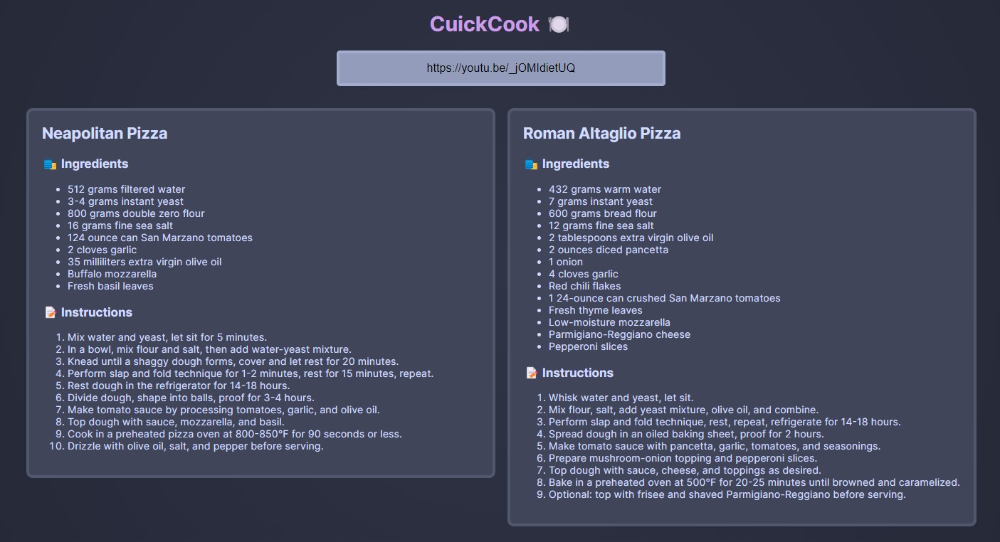
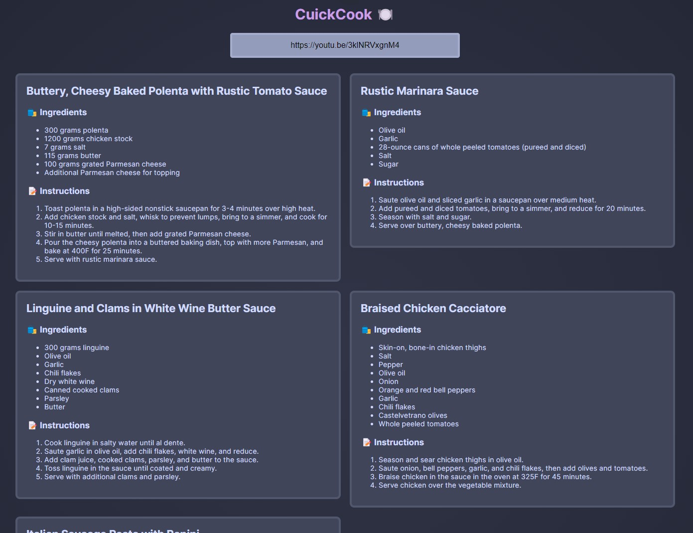
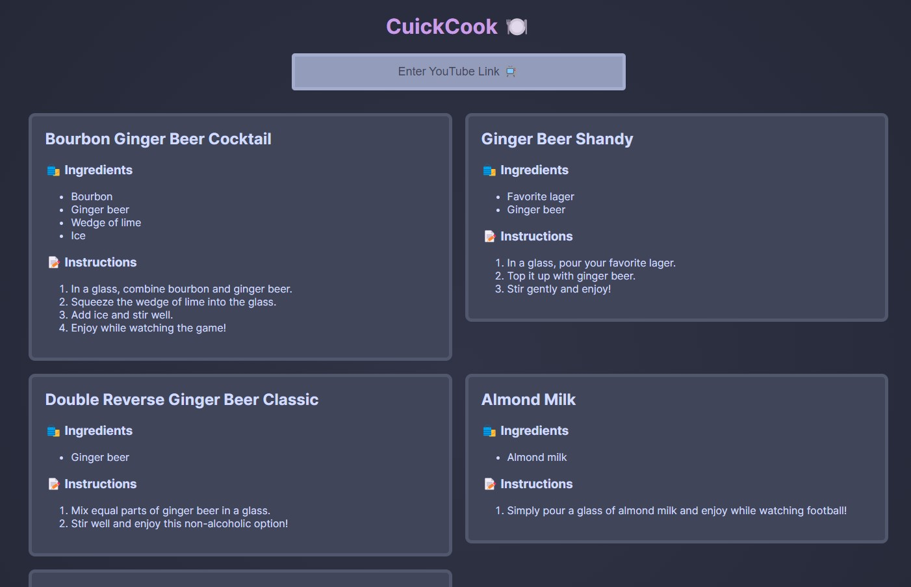

<h1 align="center">CuickCook 🍳</h1>
<h4 align="center">Transform YouTube cooking videos into easy-to-read recipe cards</h4>

  <a href="#examples">Examples</a> •
  <a href="#technologies">Technologies</a>

<h2 id="examples">🖼️ Examples</h2>

<li align="center">🍕 Joshua Weissman's <a href="https://youtu.be/_jOMIdietUQ"><i>Making Authentic Pizza At Home (2 Ways)
</i></a></li>

  

<li align="center">🍝 Brian Lagerstrom's <a href="https://youtu.be/3klNRVxgnM4"><i>4 Super Simple Italian Dishes Anyone Can Make
</i></a></li>

  

<li align="center">🍶 YSAC's <a href="https://youtu.be/H3HmwSS8YR0"><i>SUPER BOWLogna - You Suck at Cooking (episode 32)
</i></a></li>

<h2 id="technologies">⚙️ Technologies</h2>

<ul>
<li><a href="https://www.leptos.dev/"><b>Leptos</b></a> - Highly performant web framework. Used for frontend</li>
<li><a href="https://actix.rs/"><b>Actix</b></a> - Backend web framework powered by Tokio</li>
<li><a href="https://openai.com/research/whisper"><b>whisper-1</b></a> - OpenAI speech recognition model used for transcribing YouTube videos</li>
<li><a href="https://openai.com/"><b>gpt-3.5-turbo</b></a> - OpenAI completion model used for extracting information from transcripts</li>
<ul>